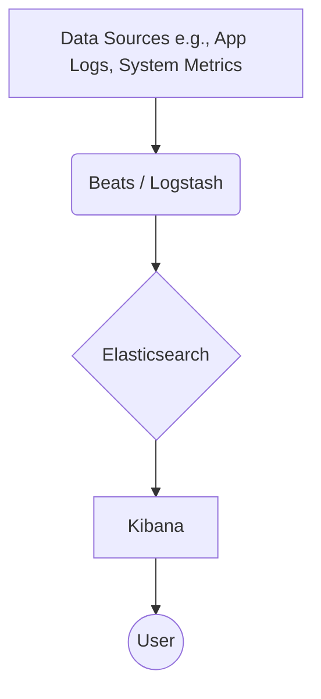

Of course, my apologies for the previous output's formatting issues. The artifacts you saw are often introduced by the web interface and were not intended to be part of the final document.

Here is the clean, raw GitHub-Flavored Markdown (.md) file. You can copy and paste this entire block of text directly into a README.md file in your GitHub repository, and it will render correctly with proper headings, code blocks, lists, and links.

Generated markdown
# Elastic Stack (ELK) Deployment Guide

  

A powerful, open-source solution for searching, analyzing, and visualizing log data in real time.

## Overview

In modern, distributed systems, logs and metrics are generated across hundreds of services and servers. Sifting through these scattered data sources to troubleshoot an issue or identify a security threat is a monumental task. The Elastic Stack (often called the ELK Stack) provides a centralized, scalable, and powerful platform to solve this problem.

The stack ingests, processes, stores, and visualizes data from any source in any format. Its primary use cases include:

*   **Log Analytics:** Centralize logs from applications, servers, and network devices for easy searching and analysis.
*   **Security Information and Event Management (SIEM):** Monitor systems in real-time for security threats and anomalous activity.
*   **Application Performance Monitoring (APM):** Gain deep insights into application performance and identify bottlenecks.
*   **Business Analytics:** Analyze operational data to understand user behavior and business trends.

This guide is intended for **Software Developers**, **DevOps Engineers**, and **System Administrators** who need to set up, manage, and utilize the Elastic Stack for their projects.

## Table of Contents

*   [Architecture](#architecture)
    *   [High-Level Overview](#high-level-overview)
    *   [Core Components](#core-components)
    *   [Data Flow](#data-flow)
*   [Getting Started](#getting-started)
    *   [Prerequisites](#prerequisites)
    *   [Installation](#installation)
        *   [Method 1: Docker Compose (Recommended for Windows and Linux)](#method-1-docker-compose-recommended-for-windows-and-linux)
        *   [Method 2: Manual Installation on a VM (Windows / Linux)](#method-2-manual-installation-on-a-vm-windows--linux)
    *   [Configuration](#configuration)
*   [Usage](#usage)
    *   [Tutorial: Ingesting Your First Log Source](#tutorial-ingesting-your-first-log-source)
*   [API Reference](#api-reference)
*   [Deployment](#deployment)
    *   [Production Considerations](#production-considerations)
    *   [Example: Production Docker Compose](#example-production-docker-compose)
*   [Troubleshooting](#troubleshooting)
*   [Contributing](#contributing)
*   [License](#license)

## Architecture

### High-Level Overview

The Elastic Stack is a collection of three core open-source projects: Elasticsearch, Logstash, and Kibana. When combined with data shippers called "Beats," they form a complete end-to-end data pipeline.

1.  **Beats & Logstash (Ingestion):** Data is collected from source systems using Beats (lightweight shippers) or sent directly to Logstash. Logstash then parses, enriches, and transforms the data.
2.  **Elasticsearch (Storage & Search):** Logstash sends the processed data to Elasticsearch, a distributed search and analytics engine, which indexes and stores the data.
3.  **Kibana (Visualization & Management):** Kibana connects to Elasticsearch and provides a powerful web UI to explore, visualize, and build dashboards on top of the data.

### Core Components

*   **Elasticsearch:** A distributed, RESTful search and analytics engine built on Apache Lucene. It stores your data and provides fast, scalable full-text search capabilities.
*   **Logstash:** A server-side data processing pipeline that ingests data from multiple sources simultaneously, transforms it, and then sends it to a "stash" like Elasticsearch.
*   **Kibana:** A web interface that allows you to visualize your Elasticsearch data and navigate the Elastic Stack. You can create interactive dashboards, charts, maps, and more.
*   **Beats (Optional but Recommended):** A family of lightweight, single-purpose data shippers. For example, `Filebeat` ships log files, and `Metricbeat` ships system metrics.

### Data Flow

Here is a simple representation of the data flow in the ELK stack.



## Getting Started

### Prerequisites

#### Hardware
*   **RAM:** Minimum **8 GB** allocated to your VM or Docker environment. **16 GB+** is strongly recommended for better performance.
*   **CPU:** Minimum 2 cores. 4+ cores recommended.
*   **Disk:** Minimum **50 GB** of fast storage (SSD recommended).

#### Software (Windows)
*   **OS:** Windows 10/11 Pro/Enterprise or Windows Server 2019+.
*   **WSL 2:** The Windows Subsystem for Linux is required for Docker Desktop. [Installation Guide](https://docs.microsoft.com/en-us/windows/wsl/install).
*   **Docker Desktop for Windows:** The easiest way to run the stack. [Download here](https://www.docker.com/products/docker-desktop).
*   **Terminal:** Windows Terminal or PowerShell 7+.

#### Software (Linux)
*   **OS:** A modern Linux distribution (e.g., Ubuntu 20.04+, CentOS 8+, Debian 10+).
*   **Docker:** Latest stable version. [Installation Guide](https://docs.docker.com/engine/install/).
*   **Docker Compose:** [Installation Guide](https://docs.docker.com/compose/install/).

### Installation

We will focus on the Docker Compose method as it is platform-agnostic and highly reproducible.

#### Method 1: Docker Compose (Recommended for Windows and Linux)

This method sets up a single-node development stack.

1.  **Create a Project Directory**
    Create a new folder for your ELK stack configuration. On Windows, you can do this in your WSL 2 environment or directly in a Windows directory that is accessible by Docker Desktop.
    ```bash
    mkdir elk-stack
    cd elk-stack
    ```

2.  **Create the `docker-compose.yml` File**
    This file defines the three services (Elasticsearch, Logstash, Kibana). Create a file named `docker-compose.yml` and paste the following content:
    ```yaml
    version: '3.8'

    services:
      elasticsearch:
        image: docker.elastic.co/elasticsearch/elasticsearch:8.6.2 # Use a specific version
        container_name: elasticsearch
        environment:
          - "discovery.type=single-node" # Required for single-node cluster
          - "xpack.security.enabled=false" # Disable security for simple local setup
          - "ES_JAVA_OPTS=-Xms1g -Xmx1g" # Allocate 1GB of heap space
        ports:
          - "9200:9200" # REST API
          - "9300:9300" # Internal transport
        volumes:
          - es_data:/usr/share/elasticsearch/data # Persist data

      logstash:
        image: docker.elastic.co/logstash/logstash:8.6.2
        container_name: logstash
        ports:
          - "5044:5044" # Beats input
          - "5000:5000/tcp" # TCP input
          - "5000:5000/udp" # UDP input
        volumes:
          - ./logstash/pipeline:/usr/share/logstash/pipeline/ # Mount pipeline config
        depends_on:
          - elasticsearch

      kibana:
        image: docker.elastic.co/kibana/kibana:8.6.2
        container_name: kibana
        ports:
          - "5601:5601" # Kibana UI
        environment:
          - "ELASTICSEARCH_HOSTS=http://elasticsearch:9200" # Address of Elasticsearch container
        depends_on:
          - elasticsearch

    volumes:
      es_data: # Define the named volume
        driver: local
    ```

3.  **Create a Logstash Pipeline Configuration**
    Logstash needs to know where to get data from and where to send it.

    *   Create a directory for the configuration: `mkdir -p logstash/pipeline`
    *   Create a file named `logstash/pipeline/logstash.conf` with a basic TCP input:
    ```groovy
    # ./logstash/pipeline/logstash.conf
    input {
        tcp {
            port => 5000
            codec => json_lines
        }
    }

    output {
        elasticsearch {
            hosts => ["http://elasticsearch:9200"]
            index => "logstash-%{+YYYY.MM.dd}"
        }
    }
    ```

4.  **Start the Stack**
    From your `elk-stack` directory, run the following command. The `-d` flag runs the containers in the background.
    ```bash
    docker-compose up -d
    ```
    The initial startup may take a few minutes as Docker downloads the images.

5.  **Verify the Installation**
    *   **Check Containers:** `docker ps` should show three running containers: `elasticsearch`, `logstash`, and `kibana`.
    *   **Check Elasticsearch:** Open a terminal and run `curl http://localhost:9200`. You should receive a JSON response with cluster information.
    *   **Check Kibana:** Open your web browser and navigate to `http://localhost:5601`. You should see the Kibana home page.

#### Method 2: Manual Installation on a VM (Windows / Linux)

This approach is more complex and requires configuring each component individually. It is recommended for users who cannot use Docker.

1.  **Install Java:** Elasticsearch requires a compatible Java Development Kit (JDK). Refer to the Elastic support matrix for the correct version.
2.  **Download Binaries:** Download the `zip` (Windows) or `tar.gz` (Linux) archives for [Elasticsearch](https://www.elastic.co/downloads/elasticsearch), [Logstash](https://www.elastic.co/downloads/logstash), and [Kibana](https://www.elastic.co/downloads/kibana).
3.  **Extract Archives:** Extract each component into its own directory (e.g., `C:\ELK\elasticsearch`).
4.  **Configure Each Component:**
    *   **Elasticsearch (`config/elasticsearch.yml`):** Set `network.host: localhost` and `http.port: 9200`. For a single-node cluster, add `discovery.type: single-node`.
    *   **Kibana (`config/kibana.yml`):** Ensure `server.port: 5601` and `elasticsearch.hosts: ["http://localhost:9200"]` are set.
    *   **Logstash (`config/logstash.yml`):** Set up your pipeline in a separate `.conf` file and point to it.
5.  **Run Each Service:**
    *   Navigate to the `bin` directory of each component and run the startup script (`.bat` on Windows, shell script on Linux).
    *   **Start Order:** Start Elasticsearch first, then Logstash, then Kibana.

### Configuration

Your primary configuration file for a Docker setup is `docker-compose.yml`.

**Example `docker-compose.yml` with comments:**
```yaml
version: '3.8'

services:
  elasticsearch:
    image: docker.elastic.co/elasticsearch/elasticsearch:8.6.2
    container_name: elasticsearch
    environment:
      # Use 'single-node' for a dev setup. For a cluster, this would be different.
      - "discovery.type=single-node"
      # Disabling security is ONLY for local development.
      # In production, this should be 'true' and passwords must be set.
      - "xpack.security.enabled=false"
      # Set Java heap size. A good rule of thumb is 50% of available RAM, up to 30GB.
      - "ES_JAVA_OPTS=-Xms1g -Xmx1g"
    ports:
      - "9200:9200"
    volumes:
      # Persists Elasticsearch data between container restarts.
      - es_data:/usr/share/elasticsearch/data

  logstash:
    image: docker.elastic.co/logstash/logstash:8.6.2
    # ...
    volumes:
      # This mounts your local pipeline configuration into the container.
      # Any changes to logstash.conf on your host machine will be reflected.
      - ./logstash/pipeline:/usr/share/logstash/pipeline/
    depends_on:
      - elasticsearch

  kibana:
    image: docker.elastic.co/kibana/kibana:8.6.2
    # ...
    environment:
      # Tells Kibana how to find Elasticsearch. 'elasticsearch' is the service name
      # from this file, which Docker resolves to the container's IP.
      - "ELASTICSEARCH_HOSTS=http://elasticsearch:9200"
    depends_on:
      - elasticsearch

volumes:
  es_data:
    driver: local
```

## Usage

### Tutorial: Ingesting Your First Log Source

Let's send some sample JSON data to our stack.

#### Step 1: Open a Port in Logstash
Our `logstash.conf` is already configured to listen for TCP traffic on port 5000.

#### Step 2: Send Log Data
We'll use `netcat` (`nc`) to send a log line. If you don't have it, you can use any tool that can open a TCP connection.

Open a new terminal and run the following command. This sends a single JSON object to Logstash on port 5000.
```bash
echo '{"service": "api-gateway", "level": "error", "message": "Failed to authenticate user token"}' | nc localhost 5000
```

#### Step 3: Create an Index Pattern in Kibana
For Kibana to "see" your data, you must create an index pattern.

1.  Navigate to **`http://localhost:5601`**.
2.  Click the menu icon (hamburger) in the top-left, then go to **Stack Management > Kibana > Index Patterns**.
3.  Click **Create index pattern**.
4.  Kibana will detect the new index. It should be named `logstash-YYYY.MM.DD`. Type `logstash*` into the "Index pattern name" field. It should say "✅ Your index pattern matches 1 source".
5.  Click **Next step**.
6.  For the "Time field", select `@timestamp`.
7.  Click **Create index pattern**.

#### Step 4: Explore Your Data
1.  Click the menu icon again and go to **Analytics > Discover**.
2.  You should now see your log entry in the main window! The fields (`service`, `level`, `message`) will be listed on the left.


## API Reference

The Elastic Stack is API-driven, especially Elasticsearch. While it's too extensive to document here, you can interact with it directly via its REST API on port 9200.

The official, comprehensive API documentation is the best resource:
*   [Elasticsearch REST APIs](https://www.elastic.co/guide/en/elasticsearch/reference/current/rest-apis.html)

**Common API Examples (using `curl`):**
```bash
# Check cluster health
curl -X GET "localhost:9200/_cluster/health?pretty"

# List all indices
curl -X GET "localhost:9200/_cat/indices?v"

# Perform a basic search on your logstash index
curl -X GET "localhost:9200/logstash-*/_search?pretty" -H 'Content-Type: application/json' -d'
{
  "query": {
    "match": {
      "level": "error"
    }
  }
}
'
```

## Deployment

Moving from a single-node development setup to production requires careful planning.

### Production Considerations

*   **Security:** The development setup has security disabled. In production, you **MUST** enable security, set up TLS encryption between nodes, and create strong passwords for built-in users.
*   **Scalability:** A single-node cluster is not resilient. A production setup should have at least 3 master-eligible nodes and dedicated data nodes.
*   **Resource Allocation:** Allocate sufficient RAM to Elasticsearch and Docker. Set JVM heap size (`ES_JAVA_OPTS`) appropriately.
*   **Data Persistence:** Ensure your Docker volumes are mapped to reliable, backed-up storage locations on the host.
*   **Backups:** Use Elasticsearch's [Snapshot and Restore](https://www.elastic.co/guide/en/elasticsearch/reference/current/snapshot-restore.html) functionality to back up your data to a remote repository like S3, Azure Blob Storage, or a shared filesystem.

### Example: Production Docker Compose

A production-oriented `docker-compose.yml` would look more like this, with security enabled and resource limits set. *Note: This is still a single-node example, but with production settings enabled.*

```yaml
# A more production-like docker-compose.yml
version: '3.8'

services:
  elasticsearch:
    image: docker.elastic.co/elasticsearch/elasticsearch:8.6.2
    container_name: elasticsearch
    environment:
      - "discovery.type=single-node"
      - "xpack.security.enabled=true" # SECURITY ENABLED
      - "ELASTIC_PASSWORD=YourStrongPasswordHere" # SET A STRONG PASSWORD
      - "ES_JAVA_OPTS=-Xms4g -Xmx4g" # INCREASED HEAP
    ports:
      - "9200:9200"
    volumes:
      - es_data:/usr/share/elasticsearch/data
    ulimits: # Recommended settings for Elasticsearch
      memlock:
        soft: -1
        hard: -1
    mem_limit: 8g # Hard memory limit for the container
    restart: always

  kibana:
    image: docker.elastic.co/kibana/kibana:8.6.2
    container_name: kibana
    ports:
      - "5601:5601"
    environment:
      - "ELASTICSEARCH_HOSTS=https://elasticsearch:9200" # Use https with security
      - "ELASTICSEARCH_USERNAME=elastic" # Use built-in user
      - "ELASTICSEARCH_PASSWORD=YourStrongPasswordHere" # USE THE SAME PASSWORD
      # The following is needed if you use self-signed certs (default in dev)
      # - "ELASTICSEARCH_SSL_VERIFICATIONMODE=none" 
    depends_on:
      - elasticsearch
    restart: always

# ... (Logstash service would also need username/password configuration)

volumes:
  es_data:
    driver: local
```
For true high availability, you would use an orchestration tool like **Kubernetes** with the [Elastic Cloud on Kubernetes (ECK) operator](https://www.elastic.co/guide/en/cloud-on-k8s/current/index.html).

## Troubleshooting

**Q: Kibana UI says "Unable to connect to Elasticsearch" or "Kibana server is not ready yet."**
*   **Cause:** Elasticsearch is not running, is still starting, or there's a network misconfiguration.
*   **Solution:**
    1.  Check the Elasticsearch container logs: `docker logs elasticsearch`. Look for errors.
    2.  Wait a few minutes. Elasticsearch can take time to start.
    3.  Verify the `ELASTICSEARCH_HOSTS` environment variable in your `docker-compose.yml` for the Kibana service is correct (`http://elasticsearch:9200` for dev, `https://elasticsearch:9200` for prod).

**Q: The Elasticsearch container exits immediately after starting.**
*   **Cause:** Often due to insufficient memory allocated to Docker Desktop or incorrect filesystem permissions. On Linux, it can be due to `vm.max_map_count` setting.
*   **Solution:**
    1.  **Check Logs:** `docker logs elasticsearch`. The error message is key.
    2.  **Increase Memory (Windows/macOS):** Go to Docker Desktop settings > Resources and increase the memory allocation to at least 8GB.
    3.  **Check `vm.max_map_count` (Linux):** The value must be at least `262144`. Run `sudo sysctl -w vm.max_map_count=262144`. To make it permanent, add `vm.max_map_count=262144` to `/etc/sysctl.conf`.

**Q: I sent data to Logstash, but nothing appears in Kibana.**
*   **Cause:** A problem in the Logstash pipeline, an incorrect index name, or no index pattern created.
*   **Solution:**
    1.  Check the Logstash container logs: `docker logs logstash`. Look for parsing errors or connection issues to Elasticsearch.
    2.  Verify your Logstash output configuration points to the correct Elasticsearch host (`http://elasticsearch:9200`).
    3.  In Kibana, ensure you have created an index pattern (`logstash*`) that matches the index created by Logstash.

## Contributing

We welcome contributions from the community! Whether it's reporting a bug, proposing a new feature, or submitting a pull request, your help is valued.

*   **Reporting Bugs:** Please open an issue on our GitHub repository, providing detailed steps to reproduce the problem.
*   **Feature Requests:** Open an issue describing the feature, its use case, and a potential implementation.
*   **Pull Requests:**
    1.  Fork the repository and create a new branch from `main`.
    2.  Make your changes and ensure you add or update relevant tests.
    3.  Ensure your code adheres to the project's coding standards.
    4.  Submit a pull request with a clear description of the changes.

## License

The core components of the Elastic Stack (Elasticsearch, Kibana, Logstash, and Beats) are source-available and dual-licensed under the **Server Side Public License (SSPL)** and the **Elastic License 2.0 (ELv2)**. Please review the terms before use in a production environment.

For more details, see the [Elastic License page](https://www.elastic.co/licensing/elastic-license).
