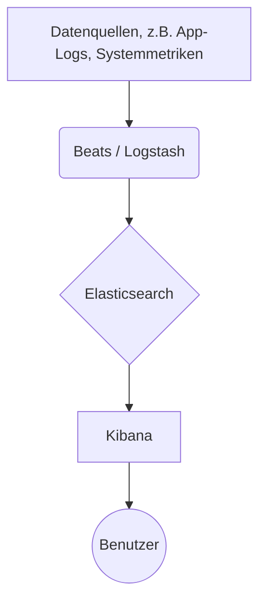

# Elastic Stack (ELK) Deployment-Anleitung

  

Eine leistungsstarke Open-Source-Lösung zur Suche, Analyse und Visualisierung von Log-Daten in Echtzeit.

## Übersicht

In modernen, verteilten Systemen werden Logs und Metriken von Hunderten von Diensten und Servern erzeugt. Das Durchsuchen dieser verstreuten Datenquellen zur Fehlerbehebung oder zur Identifizierung einer Sicherheitsbedrohung ist eine monumentale Aufgabe. Der Elastic Stack (oft als ELK Stack bezeichnet) bietet eine zentrale, skalierbare und leistungsstarke Plattform, um dieses Problem zu lösen.

Der Stack nimmt Daten aus beliebigen Quellen in beliebigen Formaten auf, verarbeitet, speichert und visualisiert sie. Seine primären Anwendungsfälle umfassen:

*   **Log-Analyse:** Zentralisieren Sie Logs von Anwendungen, Servern und Netzwerkgeräten für eine einfache Suche und Analyse.
*   **Security Information and Event Management (SIEM):** Überwachen Sie Systeme in Echtzeit auf Sicherheitsbedrohungen und anomale Aktivitäten.
*   **Application Performance Monitoring (APM):** Gewinnen Sie tiefe Einblicke in die Anwendungsleistung und identifizieren Sie Engpässe.
*   **Geschäftsanalytik:** Analysieren Sie Betriebsdaten, um das Nutzerverhalten und Geschäftstrends zu verstehen.

Diese Anleitung richtet sich an **Softwareentwickler**, **DevOps-Ingenieure** und **Systemadministratoren**, die den Elastic Stack für ihre Projekte einrichten, verwalten und nutzen müssen.

## Inhaltsverzeichnis

*   [Architektur](#architektur)
    *   [Allgemeine Übersicht](#allgemeine-übersicht)
    *   [Kernkomponenten](#kernkomponenten)
    *   [Datenfluss](#datenfluss)
*   [Erste Schritte](#erste-schritte)
    *   [Voraussetzungen](#voraussetzungen)
    *   [Installation](#installation)
        *   [Methode 1: Docker Compose (Empfohlen für Windows und Linux)](#methode-1-docker-compose-empfohlen-für-windows-und-linux)
        *   [Methode 2: Manuelle Installation auf einer VM (Windows / Linux)](#methode-2-manuelle-installation-auf-einer-vm-windows--linux)
    *   [Konfiguration](#konfiguration)
*   [Verwendung](#verwendung)
    *   [Tutorial: Ihre erste Log-Quelle einlesen](#tutorial-ihre-erste-log-quelle-einlesen)
*   [API-Referenz](#api-referenz)
*   [Deployment](#deployment)
    *   [Überlegungen für den produktiven Einsatz](#überlegungen-für-den-produktiven-einsatz)
    *   [Beispiel: Produktives Docker Compose](#beispiel-produktives-docker-compose)
*   [Fehlerbehebung](#fehlerbehebung)
*   [Mitwirken](#mitwirken)
*   [Lizenz](#lizenz)

## Architektur

### Allgemeine Übersicht

Der Elastic Stack ist eine Sammlung von drei zentralen Open-Source-Projekten: Elasticsearch, Logstash und Kibana. In Kombination mit den Daten-Shippern namens "Beats" bilden sie eine vollständige End-to-End-Datenpipeline.

1.  **Beats & Logstash (Datenerfassung):** Daten werden von Quellsystemen mit Beats (leichtgewichtige Shipper) gesammelt oder direkt an Logstash gesendet. Logstash parst, reichert an und transformiert die Daten.
2.  **Elasticsearch (Speicherung & Suche):** Logstash sendet die verarbeiteten Daten an Elasticsearch, eine verteilte Such- und Analyse-Engine, die die Daten indiziert und speichert.
3.  **Kibana (Visualisierung & Verwaltung):** Kibana verbindet sich mit Elasticsearch und bietet eine leistungsstarke Web-Benutzeroberfläche zum Erkunden, Visualisieren und Erstellen von Dashboards auf Basis der Daten.

### Kernkomponenten

*   **Elasticsearch:** Eine verteilte, RESTful Such- und Analyse-Engine, die auf Apache Lucene basiert. Sie speichert Ihre Daten und bietet schnelle, skalierbare Volltextsuchfunktionen.
*   **Logstash:** Eine serverseitige Datenverarbeitungspipeline, die Daten aus mehreren Quellen gleichzeitig aufnimmt, transformiert und dann an einen "Stash" wie Elasticsearch sendet.
*   **Kibana:** Eine Webschnittstelle, mit der Sie Ihre Elasticsearch-Daten visualisieren und im Elastic Stack navigieren können. Sie können interaktive Dashboards, Diagramme, Karten und mehr erstellen.
*   **Beats (Optional, aber empfohlen):** Eine Familie von leichtgewichtigen, spezialisierten Daten-Shippern. `Filebeat` versendet beispielsweise Log-Dateien und `Metricbeat` Systemmetriken.

### Datenfluss

Hier ist eine einfache Darstellung des Datenflusses im ELK-Stack.



## Erste Schritte

### Voraussetzungen

#### Hardware
*   **RAM:** Mindestens **8 GB**, die Ihrer VM oder Docker-Umgebung zugewiesen sind. **16 GB+** werden für eine bessere Leistung dringend empfohlen.
*   **CPU:** Mindestens 2 Kerne. 4+ Kerne empfohlen.
*   **Festplatte:** Mindestens **50 GB** schneller Speicher (SSD empfohlen).

#### Software (Windows)
*   **Betriebssystem:** Windows 10/11 Pro/Enterprise oder Windows Server 2019+.
*   **WSL 2:** Das Windows-Subsystem für Linux ist für Docker Desktop erforderlich. [Installationsanleitung](https://docs.microsoft.com/de-de/windows/wsl/install).
*   **Docker Desktop für Windows:** Der einfachste Weg, den Stack auszuführen. [Hier herunterladen](https://www.docker.com/products/docker-desktop).
*   **Terminal:** Windows Terminal oder PowerShell 7+.

#### Software (Linux)
*   **Betriebssystem:** Eine moderne Linux-Distribution (z.B. Ubuntu 20.04+, CentOS 8+, Debian 10+).
*   **Docker:** Neueste stabile Version. [Installationsanleitung](https://docs.docker.com/engine/install/).
*   **Docker Compose:** [Installationsanleitung](https://docs.docker.com/compose/install/).

### Installation

Wir konzentrieren uns auf die Docker-Compose-Methode, da sie plattformunabhängig und sehr reproduzierbar ist.

#### Methode 1: Docker Compose (Empfohlen für Windows und Linux)

Diese Methode richtet einen Single-Node-Entwicklungs-Stack ein.

1.  **Projektverzeichnis erstellen**
    Erstellen Sie einen neuen Ordner für Ihre ELK-Stack-Konfiguration. Unter Windows können Sie dies in Ihrer WSL-2-Umgebung oder direkt in einem Windows-Verzeichnis tun, das für Docker Desktop zugänglich ist.
    ```bash
    mkdir elk-stack
    cd elk-stack
    ```

2.  **Die Datei `docker-compose.yml` erstellen**
    Diese Datei definiert die drei Dienste (Elasticsearch, Logstash, Kibana). Erstellen Sie eine Datei mit dem Namen `docker-compose.yml` und fügen Sie den folgenden Inhalt ein:
    ```yaml
    version: '3.8'

    services:
      elasticsearch:
        image: docker.elastic.co/elasticsearch/elasticsearch:8.6.2 # Eine spezifische Version verwenden
        container_name: elasticsearch
        environment:
          - "discovery.type=single-node" # Erforderlich für einen Single-Node-Cluster
          - "xpack.security.enabled=false" # Sicherheit für einfache lokale Einrichtung deaktivieren
          - "ES_JAVA_OPTS=-Xms1g -Xmx1g" # 1 GB Heap-Speicher zuweisen
        ports:
          - "9200:9200" # REST-API
          - "9300:9300" # Interner Transport
        volumes:
          - es_data:/usr/share/elasticsearch/data # Daten persistent speichern

      logstash:
        image: docker.elastic.co/logstash/logstash:8.6.2
        container_name: logstash
        ports:
          - "5044:5044" # Beats-Eingang
          - "5000:5000/tcp" # TCP-Eingang
          - "5000:5000/udp" # UDP-Eingang
        volumes:
          - ./logstash/pipeline:/usr/share/logstash/pipeline/ # Pipeline-Konfiguration einbinden
        depends_on:
          - elasticsearch

      kibana:
        image: docker.elastic.co/kibana/kibana:8.6.2
        container_name: kibana
        ports:
          - "5601:5601" # Kibana-UI
        environment:
          - "ELASTICSEARCH_HOSTS=http://elasticsearch:9200" # Adresse des Elasticsearch-Containers
        depends_on:
          - elasticsearch

    volumes:
      es_data: # Das benannte Volume definieren
        driver: local
    ```

3.  **Eine Logstash-Pipeline-Konfiguration erstellen**
    Logstash muss wissen, woher die Daten kommen und wohin sie gesendet werden sollen.

    *   Erstellen Sie ein Verzeichnis für die Konfiguration: `mkdir -p logstash/pipeline`
    *   Erstellen Sie eine Datei namens `logstash/pipeline/logstash.conf` mit einem einfachen TCP-Eingang:
    ```groovy
    # ./logstash/pipeline/logstash.conf
    input {
        tcp {
            port => 5000
            codec => json_lines
        }
    }

    output {
        elasticsearch {
            hosts => ["http://elasticsearch:9200"]
            index => "logstash-%{+YYYY.MM.dd}"
        }
    }
    ```

4.  **Den Stack starten**
    Führen Sie in Ihrem `elk-stack`-Verzeichnis den folgenden Befehl aus. Das Flag `-d` startet die Container im Hintergrund.
    ```bash
    docker-compose up -d
    ```
    Der erste Start kann einige Minuten dauern, da Docker die Images herunterlädt.

5.  **Die Installation überprüfen**
    *   **Container prüfen:** `docker ps` sollte drei laufende Container anzeigen: `elasticsearch`, `logstash` und `kibana`.
    *   **Elasticsearch prüfen:** Öffnen Sie ein Terminal und führen Sie `curl http://localhost:9200` aus. Sie sollten eine JSON-Antwort mit Cluster-Informationen erhalten.
    *   **Kibana prüfen:** Öffnen Sie Ihren Webbrowser und navigieren Sie zu `http://localhost:5601`. Sie sollten die Startseite von Kibana sehen.

#### Methode 2: Manuelle Installation auf einer VM (Windows / Linux)

Dieser Ansatz ist komplexer und erfordert die individuelle Konfiguration jeder Komponente. Er wird für Benutzer empfohlen, die Docker nicht verwenden können.

1.  **Java installieren:** Elasticsearch benötigt ein kompatibles Java Development Kit (JDK). Konsultieren Sie die Elastic-Support-Matrix für die richtige Version.
2.  **Binärdateien herunterladen:** Laden Sie die `zip`- (Windows) oder `tar.gz`- (Linux) Archive für [Elasticsearch](https://www.elastic.co/downloads/elasticsearch), [Logstash](https://www.elastic.co/downloads/logstash) und [Kibana](https://www.elastic.co/downloads/kibana) herunter.
3.  **Archive entpacken:** Entpacken Sie jede Komponente in ein eigenes Verzeichnis (z.B. `C:\ELK\elasticsearch`).
4.  **Jede Komponente konfigurieren:**
    *   **Elasticsearch (`config/elasticsearch.yml`):** Setzen Sie `network.host: localhost` und `http.port: 9200`. Fügen Sie für einen Single-Node-Cluster `discovery.type: single-node` hinzu.
    *   **Kibana (`config/kibana.yml`):** Stellen Sie sicher, dass `server.port: 5601` und `elasticsearch.hosts: ["http://localhost:9200"]` gesetzt sind.
    *   **Logstash (`config/logstash.yml`):** Richten Sie Ihre Pipeline in einer separaten `.conf`-Datei ein und verweisen Sie darauf.
5.  **Jeden Dienst ausführen:**
    *   Navigieren Sie zum `bin`-Verzeichnis jeder Komponente und führen Sie das Startskript aus (`.bat` unter Windows, Shell-Skript unter Linux).
    *   **Startreihenfolge:** Starten Sie zuerst Elasticsearch, dann Logstash und dann Kibana.

### Konfiguration

Ihre primäre Konfigurationsdatei für ein Docker-Setup ist `docker-compose.yml`.

**Beispiel `docker-compose.yml` mit Kommentaren:**
```yaml
version: '3.8'

services:
  elasticsearch:
    image: docker.elastic.co/elasticsearch/elasticsearch:8.6.2
    container_name: elasticsearch
    environment:
      # Verwenden Sie 'single-node' für ein Entwicklungs-Setup. Für einen Cluster wäre dies anders.
      - "discovery.type=single-node"
      # Die Deaktivierung der Sicherheit ist NUR für die lokale Entwicklung gedacht.
      # In der Produktion sollte dies 'true' sein und Passwörter müssen gesetzt werden.
      - "xpack.security.enabled=false"
      # Java Heap Size festlegen. Eine gute Faustregel ist 50% des verfügbaren RAM, bis zu 30GB.
      - "ES_JAVA_OPTS=-Xms1g -Xmx1g"
    ports:
      - "9200:9200"
    volumes:
      # Speichert Elasticsearch-Daten persistent über Container-Neustarts hinweg.
      - es_data:/usr/share/elasticsearch/data

  logstash:
    image: docker.elastic.co/logstash/logstash:8.6.2
    # ...
    volumes:
      # Dies bindet Ihre lokale Pipeline-Konfiguration in den Container ein.
      # Änderungen an logstash.conf auf Ihrem Host-Rechner werden übernommen.
      - ./logstash/pipeline:/usr/share/logstash/pipeline/
    depends_on:
      - elasticsearch

  kibana:
    image: docker.elastic.co/kibana/kibana:8.6.2
    # ...
    environment:
      # Teilt Kibana mit, wie es Elasticsearch finden kann. 'elasticsearch' ist der Dienstname
      # aus dieser Datei, den Docker in die IP-Adresse des Containers auflöst.
      - "ELASTICSEARCH_HOSTS=http://elasticsearch:9200"
    depends_on:
      - elasticsearch

volumes:
  es_data:
    driver: local
```

## Verwendung

### Tutorial: Ihre erste Log-Quelle einlesen

Senden wir einige Beispiel-JSON-Daten an unseren Stack.

#### Schritt 1: Einen Port in Logstash öffnen
Unsere `logstash.conf` ist bereits so konfiguriert, dass sie auf TCP-Verkehr auf Port 5000 lauscht.

#### Schritt 2: Log-Daten senden
Wir verwenden `netcat` (`nc`), um eine Log-Zeile zu senden. Wenn Sie es nicht haben, können Sie jedes Werkzeug verwenden, das eine TCP-Verbindung öffnen kann.

Öffnen Sie ein neues Terminal und führen Sie den folgenden Befehl aus. Dies sendet ein einzelnes JSON-Objekt an Logstash auf Port 5000.
```bash
echo '{"service": "api-gateway", "level": "error", "message": "Failed to authenticate user token"}' | nc localhost 5000
```

#### Schritt 3: Ein Index-Muster in Kibana erstellen
Damit Kibana Ihre Daten "sehen" kann, müssen Sie ein Index-Muster (Index Pattern) erstellen.

1.  Navigieren Sie zu **`http://localhost:5601`**.
2.  Klicken Sie auf das Menü-Symbol (Hamburger) oben links und gehen Sie zu **Stack Management > Kibana > Index Patterns**.
3.  Klicken Sie auf **Create index pattern**.
4.  Kibana wird den neuen Index erkennen. Er sollte `logstash-YYYY.MM.DD` heißen. Geben Sie `logstash*` in das Feld "Index pattern name" ein. Es sollte "✅ Your index pattern matches 1 source" angezeigt werden.
5.  Klicken Sie auf **Next step**.
6.  Wählen Sie für das "Time field" `@timestamp` aus.
7.  Klicken Sie auf **Create index pattern**.

#### Schritt 4: Ihre Daten erkunden
1.  Klicken Sie erneut auf das Menü-Symbol und gehen Sie zu **Analytics > Discover**.
2.  Sie sollten nun Ihren Log-Eintrag im Hauptfenster sehen! Die Felder (`service`, `level`, `message`) werden auf der linken Seite aufgelistet.


## API-Referenz

Der Elastic Stack ist API-gesteuert, insbesondere Elasticsearch. Obwohl die API zu umfangreich ist, um sie hier zu dokumentieren, können Sie direkt über die REST-API auf Port 9200 damit interagieren.

Die offizielle, umfassende API-Dokumentation ist die beste Ressource:
*   [Elasticsearch REST APIs](https://www.elastic.co/guide/en/elasticsearch/reference/current/rest-apis.html)

**Gängige API-Beispiele (mit `curl`):**
```bash
# Cluster-Zustand prüfen
curl -X GET "localhost:9200/_cluster/health?pretty"

# Alle Indizes auflisten
curl -X GET "localhost:9200/_cat/indices?v"

# Eine einfache Suche im Logstash-Index durchführen
curl -X GET "localhost:9200/logstash-*/_search?pretty" -H 'Content-Type: application/json' -d'
{
  "query": {
    "match": {
      "level": "error"
    }
  }
}
'
```

## Deployment

Der Übergang von einem Single-Node-Entwicklungs-Setup zur Produktion erfordert eine sorgfältige Planung.

### Überlegungen für den produktiven Einsatz

*   **Sicherheit:** Im Entwicklungs-Setup ist die Sicherheit deaktiviert. In der Produktion **MÜSSEN** Sie die Sicherheit aktivieren, TLS-Verschlüsselung zwischen den Knoten einrichten und starke Passwörter für die integrierten Benutzer erstellen.
*   **Skalierbarkeit:** Ein Single-Node-Cluster ist nicht ausfallsicher. Ein produktives Setup sollte mindestens 3 Master-fähige Knoten und dedizierte Datenknoten haben.
*   **Ressourcenzuweisung:** Weisen Sie Elasticsearch und Docker ausreichend RAM zu. Setzen Sie die JVM Heap Size (`ES_JAVA_OPTS`) entsprechend.
*   **Datenpersistenz:** Stellen Sie sicher, dass Ihre Docker-Volumes auf zuverlässige, gesicherte Speicherorte auf dem Host abgebildet sind.
*   **Backups:** Verwenden Sie die [Snapshot- und Wiederherstellungsfunktion](https://www.elastic.co/guide/en/elasticsearch/reference/current/snapshot-restore.html) von Elasticsearch, um Ihre Daten in einem Remote-Repository wie S3, Azure Blob Storage oder einem gemeinsam genutzten Dateisystem zu sichern.

### Beispiel: Produktives Docker Compose

Eine produktionsorientierte `docker-compose.yml` würde eher so aussehen, mit aktivierter Sicherheit und gesetzten Ressourcenlimits. *Hinweis: Dies ist immer noch ein Single-Node-Beispiel, aber mit aktivierten Produktionseinstellungen.*

```yaml
# Eine produktionsnähere docker-compose.yml
version: '3.8'

services:
  elasticsearch:
    image: docker.elastic.co/elasticsearch/elasticsearch:8.6.2
    container_name: elasticsearch
    environment:
      - "discovery.type=single-node"
      - "xpack.security.enabled=true" # SICHERHEIT AKTIVIERT
      - "ELASTIC_PASSWORD=IhrStarkesPasswortHier" # EIN STARKES PASSWORT FESTLEGEN
      - "ES_JAVA_OPTS=-Xms4g -Xmx4g" # ERHÖHTER HEAP
    ports:
      - "9200:9200"
    volumes:
      - es_data:/usr/share/elasticsearch/data
    ulimits: # Empfohlene Einstellungen für Elasticsearch
      memlock:
        soft: -1
        hard: -1
    mem_limit: 8g # Hartes Speicherlimit für den Container
    restart: always

  kibana:
    image: docker.elastic.co/kibana/kibana:8.6.2
    container_name: kibana
    ports:
      - "5601:5601"
    environment:
      - "ELASTICSEARCH_HOSTS=https://elasticsearch:9200" # https mit Sicherheit verwenden
      - "ELASTICSEARCH_USERNAME=elastic" # Integrierten Benutzer verwenden
      - "ELASTICSEARCH_PASSWORD=IhrStarkesPasswortHier" # DASSELBE PASSWORT VERWENDEN
      # Folgendes wird benötigt, wenn Sie selbstsignierte Zertifikate verwenden (Standard in der Entwicklung)
      # - "ELASTICSEARCH_SSL_VERIFICATIONMODE=none"
    depends_on:
      - elasticsearch
    restart: always

# ... (Der Logstash-Dienst würde ebenfalls eine Benutzername/Passwort-Konfiguration benötigen)

volumes:
  es_data:
    driver: local
```
Für echte Hochverfügbarkeit würden Sie ein Orchestrierungstool wie **Kubernetes** mit dem [Elastic Cloud on Kubernetes (ECK) Operator](https://www.elastic.co/guide/en/cloud-on-k8s/current/index.html) verwenden.

## Fehlerbehebung

**F: Die Kibana-UI sagt "Unable to connect to Elasticsearch" oder "Kibana server is not ready yet."**
*   **Ursache:** Elasticsearch läuft nicht, startet noch oder es liegt eine Netzwerkkonfigurationsfehler vor.
*   **Lösung:**
    1.  Überprüfen Sie die Logs des Elasticsearch-Containers: `docker logs elasticsearch`. Suchen Sie nach Fehlern.
    2.  Warten Sie einige Minuten. Elasticsearch kann einige Zeit zum Starten benötigen.
    3.  Überprüfen Sie, ob die Umgebungsvariable `ELASTICSEARCH_HOSTS` in Ihrer `docker-compose.yml` für den Kibana-Dienst korrekt ist (`http://elasticsearch:9200` für Dev, `https://elasticsearch:9200` für Prod).

**F: Der Elasticsearch-Container wird sofort nach dem Start beendet.**
*   **Ursache:** Oft aufgrund von unzureichendem Speicher, der Docker Desktop zugewiesen wurde, oder falschen Dateisystemberechtigungen. Unter Linux kann es an der Einstellung `vm.max_map_count` liegen.
*   **Lösung:**
    1.  **Logs prüfen:** `docker logs elasticsearch`. Die Fehlermeldung ist entscheidend.
    2.  **Speicher erhöhen (Windows/macOS):** Gehen Sie zu den Docker Desktop-Einstellungen > Resources und erhöhen Sie die Speicherzuweisung auf mindestens 8 GB.
    3.  **`vm.max_map_count` prüfen (Linux):** Der Wert muss mindestens `262144` betragen. Führen Sie `sudo sysctl -w vm.max_map_count=262144` aus. Um es dauerhaft zu machen, fügen Sie `vm.max_map_count=262144` zu `/etc/sysctl.conf` hinzu.

**F: Ich habe Daten an Logstash gesendet, aber in Kibana erscheint nichts.**
*   **Ursache:** Ein Problem in der Logstash-Pipeline, ein falscher Indexname oder es wurde kein Index-Muster erstellt.
*   **Lösung:**
    1.  Überprüfen Sie die Logs des Logstash-Containers: `docker logs logstash`. Suchen Sie nach Parsing-Fehlern oder Verbindungsproblemen zu Elasticsearch.
    2.  Überprüfen Sie, ob Ihre Logstash-Ausgabekonfiguration auf den richtigen Elasticsearch-Host (`http://elasticsearch:9200`) verweist.
    3.  Stellen Sie in Kibana sicher, dass Sie ein Index-Muster (`logstash*`) erstellt haben, das mit dem von Logstash erstellten Index übereinstimmt.

## Mitwirken

Wir freuen uns über Beiträge aus der Community! Ob es sich um das Melden eines Fehlers, das Vorschlagen einer neuen Funktion oder das Einreichen eines Pull-Requests handelt, Ihre Hilfe wird geschätzt.

*   **Fehler melden:** Bitte öffnen Sie ein Issue in unserem GitHub-Repository und geben Sie detaillierte Schritte zur Reproduktion des Problems an.
*   **Funktionswünsche:** Öffnen Sie ein Issue, das die Funktion, ihren Anwendungsfall und eine mögliche Implementierung beschreibt.
*   **Pull-Requests:**
    1.  Forken Sie das Repository und erstellen Sie einen neuen Branch von `main`.
    2.  Nehmen Sie Ihre Änderungen vor und stellen Sie sicher, dass Sie relevante Tests hinzufügen oder aktualisieren.
    3.  Stellen Sie sicher, dass Ihr Code den Codierungsstandards des Projekts entspricht.
    4.  Senden Sie einen Pull-Request mit einer klaren Beschreibung der Änderungen.

## Lizenz

Die Kernkomponenten des Elastic Stack (Elasticsearch, Kibana, Logstash und Beats) sind Source-Available und unter der **Server Side Public License (SSPL)** und der **Elastic License 2.0 (ELv2)** doppelt lizenziert. Bitte überprüfen Sie die Bedingungen vor der Verwendung in einer produktiven Umgebung.

Weitere Details finden Sie auf der [Elastic-Lizenzseite](https://www.elastic.co/licensing/elastic-license).
